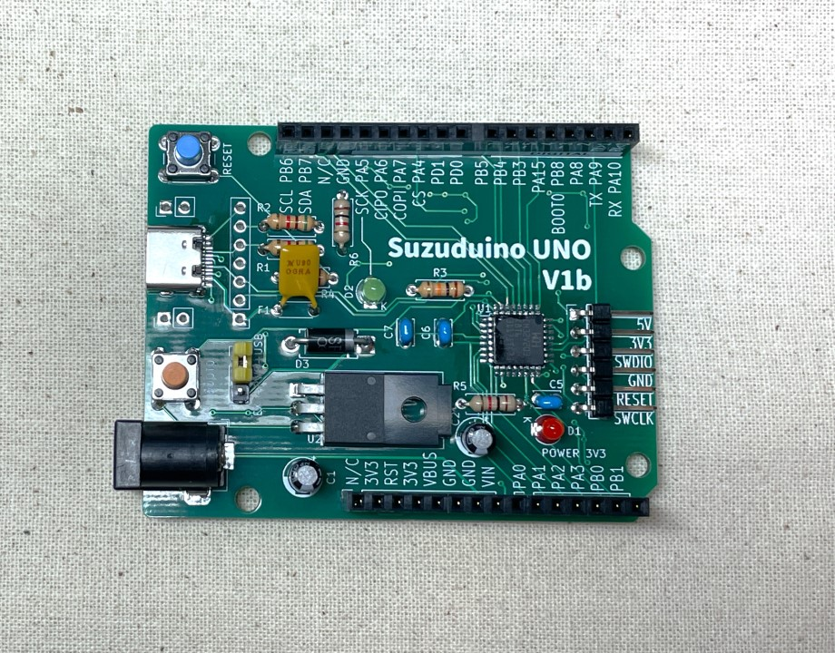

Suzuduino UNOシリーズは、Arduino UNO形状の基板のプロトタイピング向けマイコンボードです。

Suzuduino UNO series is a prototyping board in Arduino UNO form factor.

## Suzuduino UNO V1b

**Suzuduino UNO V1b**は、**WCH CH32V203K8T6**を採用したマイコンボードです。RISC-V MCUのプロトタイピングにご利用ください。

Suzuduino UNO V1b is a prototyping board with WCH CH32V203K8T6 (RISC-V 32bit RV32IMAC). 

V1b is a modified version of V1a, and same in functionally.

**プリント基板が買えます！ / Buy the PCB at → [ショップ「スズの宝箱」](https://suzu3tsu.booth.pm/)**

 - [Short guide (PDF)](docs/suzuduino-uno-v1b_ShortGuide_01.pdf)
 - [README](docs/suzuduino-uno-v1_README.md)
 - [Examples](examples/README.md)
 - [Schematic (PDF)](drawings/suzuduino-uno-v1b_schematic.pdf)

## Suzuduino UNO V1a

**販売終了 / End of sales**

**同一機能で修正版の"V1b"をご利用ください。 Use "V1b" which is modified version and has same function.**

Suzuduino UNO V1aは、WCH CH32V203K8T6を採用したマイコンボードです。RISC-V MCUのプロトタイピングにご利用ください。

Suzuduino UNO V1a is a prototyping board with WCH CH32V203K8T6 (RISC-V 32bit RV32IMAC).

 - [Short guide (PDF)](docs/suzuduino-uno-v1a_ShortGuide_02.pdf)
 - [README](docs/suzuduino-uno-v1_README.md)
 - [Examples](examples/README.md)
 - [Schematic (PDF)](drawings/suzuduino-uno-v1a_schematic.pdf)

## License

個別に表記がある場合、それに従ってください。表記がない場合、[CC BY-SA 4.0](http://creativecommons.org/licenses/by-sa/4.0/) です。

Follow the each license declaration if provided in the content. If not, license is CC BY-SA 4.0.
