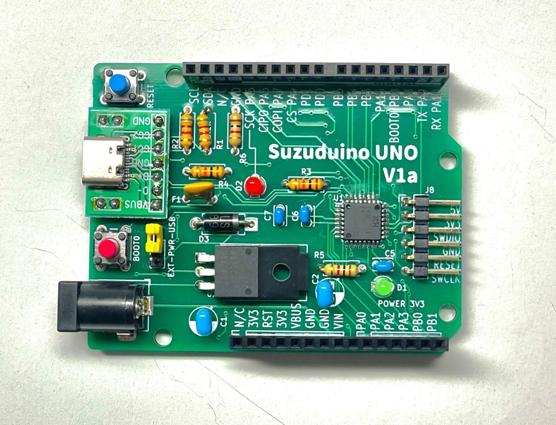

Suzuduino UNOは、Arduino UNO形状の基板のプロトタイピング向けマイコンボードです。
Suzuduino UNO series is a prototyping board in Arduino UNO shape.

## Suzuduino UNO V1a

**Suzuduino UNO V1a**は、**WCH CH32V203K8T6**を採用したマイコンボードです。RISC-V MCUのプロトタイピングにご利用ください。
Suzuduino UNO V1a is a prototyping board with WCH CH32V203K8T6 (RISC-V 32bit RV32IMAC).

**プリント基板が買えます → [スズの宝箱](https://suzu3tsu.booth.pm/) !**

 - [Short guide (PDF)](docs/suzuduino-uno-v1a_ShortGuide.pdf)
 - [README](docs/suzuduino-uno-v1a_README.md)
 - [Examples](examples/README.md)
 - [Schematic (PDF)](drawings/suzuduino-uno-v1a_schematic.pdf)

## License

個別に表記がある場合、それに従ってください。表記がない場合、[CC BY-SA 4.0](http://creativecommons.org/licenses/by-sa/4.0/) です。

Follow the each license declaration if provided in the content. If not, license is CC BY-SA 4.0.
