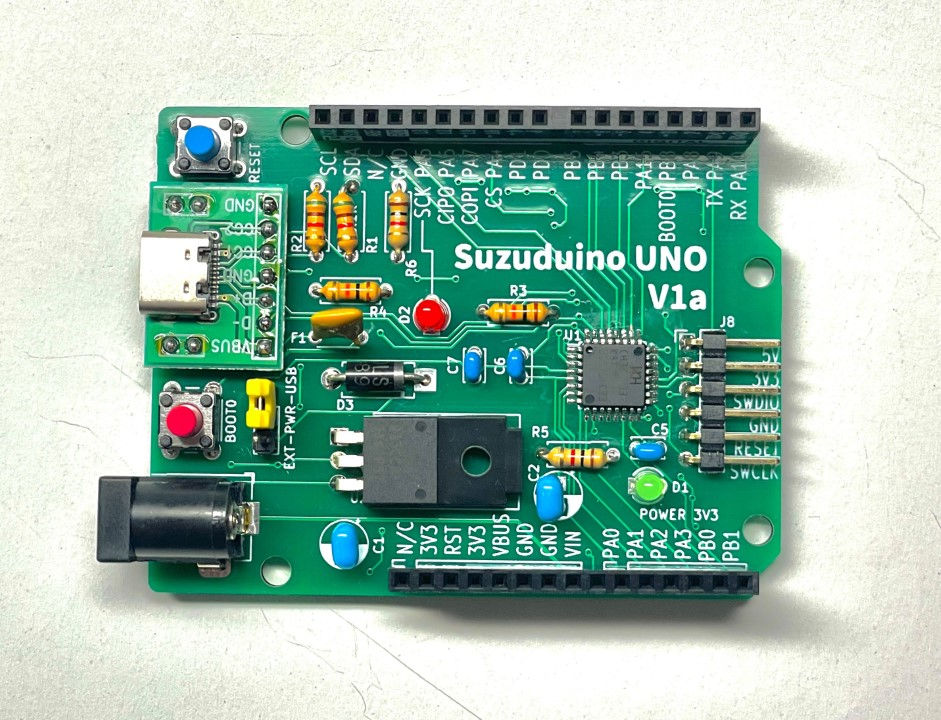

**Suzuduino UNO V1a**は、**WCH CH32V203K8T6**を採用したマイコンボードです。RISC-V MCUのプロトタイピングにご利用ください。

Suzuduino UNO V1a is a prototyping board with WCH CH32V203K8T6 (RISC-V 32bit RV32IMAC).

**プリント基板が買えます！ / Buy the PCB at → [ショップ「スズの宝箱」](https://suzu3tsu.booth.pm/)**

 - [販売品に添付のドキュメント (PDF)](../docs/suzuduino-uno-v1a_ShortGuide.pdf) 
 - [プログラム例](../examples/README.md)
 - [回路図 (PDF)](../drawings/suzuduino-uno-v1a_schematic.pdf)

CH32Vマイコンが日本でも容易に安価に入手可能になりました。しかしまだ情報や作例は多くありません。ぜひこの基板を使って、この楽しいチップを探求してみてください！

In Japan, CH32V microcontrollers are now able to be bought easier in cheap price. But information and articles are few and not enough. Let's dive into the interesting cheap chip!

ソフトウェアはUSB経由で書き込むことができます。WCH-LinkEも利用できます。

You can burn the firmware via USB. WCH-LinkE is also available.

ソフトウェア開発環境はご自身でお調べのうえ、構築してください。

Please search and build the software development environment yoruself.

質問がある場合は、GitHub Discussion をご利用ください。
If you have any question, please post on GitHub Discussion.

目次：
 1. 組み立て方 / Build instruciton
 1. 部品表 / Required components
 1. スペック / Specs
 1. 訂正箇所 / Errata
 1. 活用のヒント / Tips

## 組み立て方 / Build instruciton

基板の表記と回路図を照らし合わせて組み立ててください。0.5mmピッチのICのはんだ付けは、方向に気をつけて、慎重に行ってください。USB Type-Cコネクタは変換基板の利用がおすすめです。代わりに表面実装Type-Cコネクタを使うこともできますが、訂正情報も参照してください。

LEDは、四角いランドの側がカソード（GND側）です。

## 部品表 / Required components

| 種類 | 商品名・スペック | 数量 | 参考URL |
|---|---|--- |---|
| マイコン | WCH CH32V203K8T6 | 1 |  https://akizukidenshi.com/catalog/g/gI-18063/ |
| 抵抗 | 10K | 2 | https://akizukidenshi.com/catalog/g/gR-25103/ |
| 抵抗 | 1K | 2 | https://akizukidenshi.com/catalog/g/gR-25102/ |
| 抵抗 | 5.1K | 2 | https://akizukidenshi.com/catalog/g/gR-07832/|
| コンデンサ | 10u | 2 | https://akizukidenshi.com/catalog/g/gP-10590/ |
| コンデンサ | 0.1u | 3 | https://akizukidenshi.com/catalog/g/gP-00090/ |
| LED | 3mm | 2 | https://akizukidenshi.com/catalog/g/gI-11577/ |
| ポリスイッチ | 0.9A/1.8A | 1 | https://akizukidenshi.com/catalog/g/gP-13593/ |
| ダイオード | ショットキーバリアダイオード | 1 | https://akizukidenshi.com/catalog/g/gI-07788/ |
| 三端子レギュレータ | TO-220 3.3V出力 | 1 | https://akizukidenshi.com/catalog/g/gI-13675/ |
| スイッチ | タクトスイッチ 6mm | 2 | https://akizukidenshi.com/catalog/g/gP-03647/ |
| ピンヘッダ | 2.54mm 6コマ、3コマ | — | https://akizukidenshi.com/catalog/g/gC-00167/ |
| ピンソケット | 2.54mm 8コマ、10コマ、6コマ、8コマ | — | https://akizukidenshi.com/catalog/g/gC-17504/ https://akizukidenshi.com/catalog/g/gC-17503/ |
| ジャンパーピン | 2.54mm 2コマ | 1 | https://akizukidenshi.com/catalog/g/gP-03691/ |
| DCジャック | 5.5mm/2.1mm | 1 | https://akizukidenshi.com/catalog/g/gC-06568/ |
| Type-Cコネクタ変換基板 | 2.54mmピッチ変換基板 | 1 | https://akizukidenshi.com/catalog/g/gK-15426/ |
| 表面実装Type-Cコネクタ | （※上記の変換基板の代わり） 5077CR-16-SMC2-BK-TR | 1 | https://akizukidenshi.com/catalog/g/gC-14356/ |

## スペック / Specs

| | |
|---|---|
| MCU | WCH CH32V203K8T6 RISC-V 32bit RV32IMAC with custom instructions |
| RAM | 20KB |
| ROM | 64KB |
| I/O voltage | 3.3V |
| Board size | about 68x53mm |
| Power source | USB or DC jack (5V-12V) |
| Digital pins | 16 + 6 |
| Analog pins | 6 |
| Interface | USB, I2C, SPI, UART etc |

## 訂正箇所 / Errata

 - 基板上の「BOOT0」と「RESET」の表記が逆になっています。
    - 正しくは、基板の角にあるのが「BOOT0」、DCジャックの横にあるのが「RESET」です。
 - 表面実装Type-CのVBUSがポリヒューズで保護されていません。
    - 変換基板の利用をお勧めします。

## 活用のヒント / Tips

**電源の選択**

電源の選択は、"EXT-PWR-USB"の刻印のピンヘッダで行ないます。どちらか一方をジャンパーピンで選択してください。

**USB経由でのソフトウェアの書き込み**

WCH社が配布するWCHISPStudioを起動し、チップはCH32V203K8T6を選択します。本ボードのRESETボタンを押す（離さない）→BOOT0ボタンを押す（離さない）→2秒待機→RESETボタンを離す→BOOT0ボタンを離す、の手順で、マイコンがUSB書き込み待機モードで起動します。”Enable RRP”のチェックは外します。WCHISPStudioの”Download File”から書き込みたいhexファイルを選択し、”Download”ボタンをクリックします。

**開発環境**

WCH社ではMounRiver IDEを案内しています。ほかに、Arduino向けのボードライブラリがあります。わたし個人は https://github.com/openwch/arduino_core_ch32 を利用しています。 まだまだ開発途上なので、ぜひいろいろ試して、足りないところはご自身で探求・開発していってください。

**Arduino UNOとの互換性はほぼないです**

書くまでもありませんがいちおう明記しておくと、UNOの基板形状やピンヘッダ配置を参考にしただけですので、互換性はほぼありません。シールドはおそらく流用できないでしょう。そもそもI/O電圧が3.3Vですし。

**ピンの制限**

 - PB8は入力に使うことはできません。起動時はBOOT0として入力がチェックされますが、ユーザープログラムでは出力としてのみ利用可能です。
 - PD0, PD1は起動時には外部発振器の接続ピンとして初期化されます。コードでGPIOとして初期化すれば、GPIOとして利用できます。
